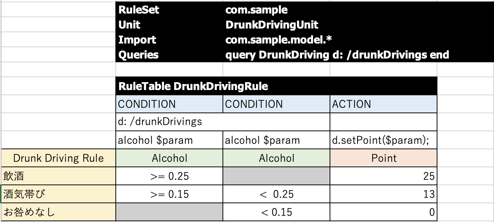

# RuleUnitによるルール作成 #

# プロジェクト作成
  ```
  mvn archetype:generate \
    -DinteractiveMode=false \
    -DarchetypeGroupId=org.kie.kogito \
    -DarchetypeArtifactId=kogito-quarkus-archetype \
    -DarchetypeVersion=1.6.0.Final \
    -DgroupId=com.sample \
    -DartifactId=ruleunit-tutorial \
    -Dversion=1.0.0-SNAPSHOT
  ```

# 準備
サンプルファイルの削除
```
> cd ruleunit-tutorial
> rm src/main/resources/Traffic\ Violation.dmn
> rm src/main/resources/test-process.bpmn2
> rm src/test/java/com/sample/*.java
```

# Kogito拡張機能追加
```
> mvn quarkus:add-extensions -Dextension=org.kie.kogito:kogito-drools
> mvn quarkus:add-extensions -Dextension=org.kie.kogito:drools-decisiontables
```
[lombokインストール](https://projectlombok.org)

# ファクトクラスの作成
src/main/java/com/sampleフォルダに”model”フォルダを作成し、以下のjavaファイルを追加する。
[DrunkDriving.java](https://github.com/keijijin/ruleunit-tutorial/blob/master/src/main/java/com/sample/model/DrunkDriving.java)
```
package com.sample.model;
 
import org.kie.api.definition.type.ClassReactive;
import lombok.AllArgsConstructor;
import lombok.Data;
import lombok.NoArgsConstructor;
 
@ClassReactive
@Data
@AllArgsConstructor
@NoArgsConstructor
public class DrunkDriving {
   private Double alcohol;
   private Integer point;
}
```

# RuleUnitDataクラスの作成
src/main/java/com/sampleフォルダに以下のjavaファイルを追加する。
[DrunkDrivingUnit.java](src/main/java/com/sample/DrunkDrivingUnit.java)
```
package com.sample;
 
import com.sample.model.DrunkDriving;
import org.kie.kogito.rules.DataSource;
import org.kie.kogito.rules.DataStore;
import org.kie.kogito.rules.RuleUnitData;
import lombok.AllArgsConstructor;
import lombok.Data;
import lombok.NoArgsConstructor;
 
@Data
@NoArgsConstructor
@AllArgsConstructor
public class DrunkDrivingUnit implements RuleUnitData {
   private DataStore<DrunkDriving> drunkDrivings = DataSource.createStore();
}
```

# デシジョンテーブル作成

[DrunkDrivingRule.xlsx](src/main/resources/com/sample/DrunkDrivingRule.xlsx)


# ルール実行

- Compile and Run

    ```
     mvn clean package quarkus:dev
    ```

- Native Image (requires JAVA_HOME to point to a valid GraalVM)

    ```
    mvn clean package -Pnative
    ```
  
  native executable (and runnable jar) generated in `target/`

# ルールのテスト

Generated application comes with sample test process that allows you to verify if the application is working as expected. Simply execute following command to try it out

```sh
curl -d '{"drunkDrivings":[{"alcohol":0.25}]}' -H "Content-Type: application/json" -X POST http://localhost:8080/drunk-driving
```

Once successfully invoked you should see [{"alcohol":0.25,"point":25}] in the console of the running application.

The generated application provides out of the box multiple samples of Kogito assets; you can reference the generated Swagger documentation and JUnit tests.

# Developing

Add your business assets resources (process definition, rules, decisions) into src/main/resources.

Add your java classes (data model, utilities, services) into src/main/java.

Then just build the project and run.


# OpenAPI (Swagger) documentation
[Specification at swagger.io](https://swagger.io/docs/specification/about/)

The exposed service [OpenAPI specification](https://swagger.io/docs/specification) is generated at 
[/q/openapi](http://localhost:8080/q/openapi).

You can visualize and interact with the generated specification using the embbeded [Swagger UI](http://localhost:8080/q/swagger-ui) or importing the generated specification file on [Swagger Editor](https://editor.swagger.io).

In addition client application can be easily generated from the swagger definition to interact with this service.
